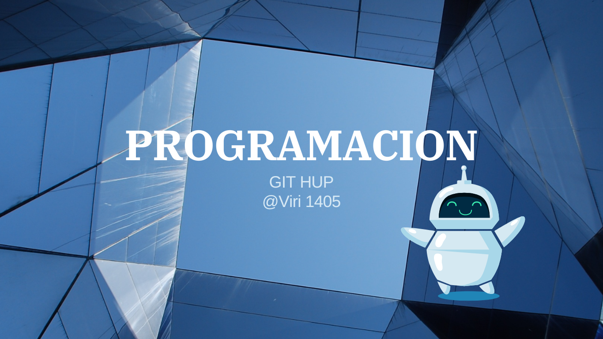

# 

  "¡Bienvenidos al ritmo de nuestra melodía! Aquí cada nota cuenta una historia."

[ 

#### Soy un músico oaxaqueño apasionado por la lectura y el dibujo. En mi tiempo libre, disfruto creando arte inspirado en el anime, combinando mi amor por la música tradicional con mi creatividad visual. Cada proyecto es una fusión de mis raíces culturales y mi fascinación por los mundos imaginarios

# Acerca de mi 🎶

### Musicoaxaqueño...arte...anime...sones y jarabes danza bella oaxaqueña

### Mi identidad como músico oaxaqueño se manifiesta en la mezcla de sones y jarabes. Mi arte y mi música rinden homenaje a la danza bella oaxaqueña, creando una sinfonía visual y sonora."

### Para mas información te puedes comunicar por Correo  virylorenzo235@gmail.com

# Proyectos 😎: 
La programación es como resolver acertijos, cada línea de código es una pieza clave.

A medida que practicas, te vuelves mejor organizando tus ideas de manera clara y lógica.

# Tecnologia💻

 

 

<!--
**Viri1405/Viri1405** is a ✨ _special_ ✨ repository because its `README.md` (this file) appears on your GitHub profile.

Here are some ideas to get you started:

- 🔭 I’m currently working on ...
- 🌱 I’m currently learning ...
- 👯 I’m looking to collaborate on ...
- 🤔 I’m looking for help with ...
- 💬 Ask me about ...
- 📫 How to reach me: ...
- 😄 Pronouns: ...
- ⚡ Fun fact: ...
-->
